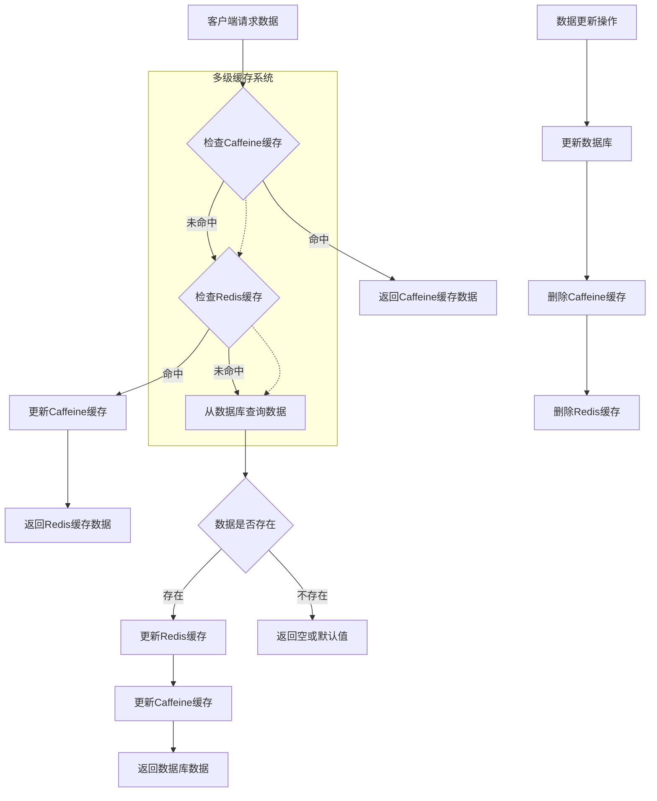
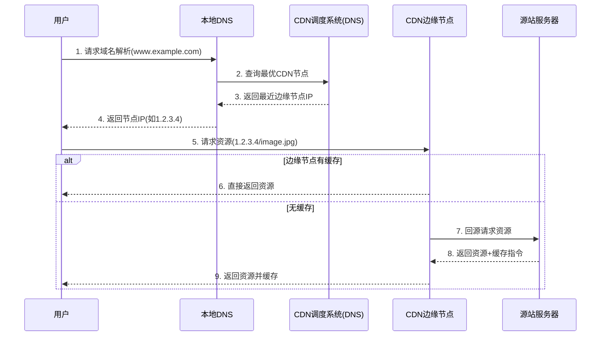

## 后端

[toc]

---

## 基于tencet OSS 实现图片上传和下载


通过配置`CosClient`我们可以封装OSS服务

```java
@Configuration
@EnableConfigurationProperties(CosConfig.class)
public class CosClientConfig {

    @Resource
    private CosConfig cosConfig;

    @Bean
    public COSClient cosClient() {
        COSCredentials cosClient = new BasicCOSCredentials(cosConfig.getSecretID(), cosConfig.getSecretKey());
        ClientConfig clientConfig = new ClientConfig(new Region(cosConfig.getRegion()));

        return new COSClient(cosClient, clientConfig);
    }
}
```

```java
public interface OSService {

    String upload(String fileKey, File file);

    UploadFileResult uploadWithInfo(String fileKey, File file);

    byte[] getObjectContentByKey(String filePath);

    void removeObjectByUrl(String url);
}
```


## 一阶段: 用户模块与基础图片模块

主要实现用户管理还有图片增删改查


## 阶段二 用户上传与审核功能


**用户上传图片*** ***管理员审核(AI审核)**

首先添加字段

```sql
ALTER TABLE picture  
    -- 添加新列  
    ADD COLUMN reviewStatus INT DEFAULT 0 NOT NULL COMMENT '审核状态：0-待审核; 1-通过; 2-拒绝',  
    ADD COLUMN reviewMessage VARCHAR(512) NULL COMMENT '审核信息',  
    ADD COLUMN reviewerId BIGINT NULL COMMENT '审核人 ID',  
    ADD COLUMN reviewTime DATETIME NULL COMMENT '审核时间';  
  
-- 创建基于 reviewStatus 列的索引  
CREATE INDEX idx_reviewStatus ON picture (reviewStatus);

```


用来表示图片上传后进行的审核操作

我们可以对每一个传入的修改和上传请求都做审核处理

```java
   @Override
    public void doPictureReview(PictureReviewRequest pictureReviewRequest, User loginUser) {
        Long id = pictureReviewRequest.getId();
        Integer reviewStatus = pictureReviewRequest.getReviewStatus();
        PictureReviewStatusEnum statusEnum = PictureReviewStatusEnum.getEnumByValue(reviewStatus);
        String reviewMessage = pictureReviewRequest.getReviewMessage();
        if (Objects.isNull(id) || Objects.isNull(statusEnum) || PictureReviewStatusEnum.REVIEWING.equals(statusEnum)) {
            throw new BusinessException(ErrorCode.PARAMS_ERROR);
        }

        Picture picture = this.getById(id);
        if (Objects.isNull(picture)) {
            throw new BusinessException(ErrorCode.NOT_FOUND_ERROR);
        }

        if (picture.getReviewStatus().equals(reviewStatus)) {
            throw new BusinessException(ErrorCode.OPERATION_ERROR, "请勿重复审核!");
        }

        Picture updatePicture = new Picture();
        BeanUtils.copyProperties(pictureReviewRequest, updatePicture);
        updatePicture.setReviewerId(loginUser.getId());
        updatePicture.setReviewTime(new Date());
        ThrowUtils.throwIf(!this.updateById(updatePicture), ErrorCode.SYSTEM_ERROR);
    }
```

### 基于url的上传

首先我们任何文件传进来都会有下载到本地 + 上传到服务器这一步, 也就是说，我们可以单独抽象下载到本地这一个步骤，并且接收`url`参数、`MultipartFile`参数, 最终都会返回


#### 验证`URL`上传的内容

基于`Hutool.FileUtil`以及`Hutool.HttpUtil` 我们可以很容易实现对url目标对象的校验和审查

我们需要验证:

- url的有效性
- 协议的正确性(http, https)
- 文件是否存在
- 文件类型校验
- 文件大小校验
- 拓展: `AI`审查具体内容

```java
@Override
    public void validPicture(Object inputSource) {
        ThrowUtils.throwIf(Objects.isNull(inputSource), ErrorCode.PARAMS_ERROR, "文件不能为空");
        String url = (String) inputSource;

        ThrowUtils.throwIf(!(url.startsWith("http://") || url.startsWith("https://")), ErrorCode.PARAMS_ERROR);

        try { new URL(url); } catch (MalformedURLException e) {
            throw new BusinessException(ErrorCode.PARAMS_ERROR, e.getMessage());
        }

        try ( HttpResponse httpResponse = HttpUtil.createRequest(Method.HEAD, url).execute()) {

            if (httpResponse.getStatus() != HttpStatus.HTTP_OK) {
                throw  new BusinessException(ErrorCode.PARAMS_ERROR, "无法获取图片信息");
            }

            String contentType = httpResponse.header("Content-Type");

            if (StrUtil.isNotBlank(contentType)) {
                final List<String> ALLOW_CONTENT_TYPES = Arrays.asList("image/jpeg", "image/png", "image/gif", "image/webp");
                ThrowUtils.throwIf(!ALLOW_CONTENT_TYPES.contains(contentType), ErrorCode.FORBIDDEN_ERROR, "禁止的文件类型!");

            }
            String contentLength = httpResponse.header("Content-Length");

            if (StrUtil.isNotBlank(contentLength)) {
                long length = Long.parseLong(contentLength);
                final long ONE_M = 1024 * 1024;
                final long limit = maxImageUploadSize * ONE_M;
                ThrowUtils.throwIf(limit < length, ErrorCode.FORBIDDEN_ERROR, "上传文件太大! 不得超过 " + limit + "MB");
            }
        } catch (Exception e) {
            e.printStackTrace();
            throw  new BusinessException(ErrorCode.SYSTEM_ERROR, e.getMessage());
        }
    }
```

使用**模板方法** + **策略模式**, 我们可以轻松实现多种上传方式的引入.

### 基于搜索关键字的抓取

通过`jsoup`库，我们可以通过解析外部`html`来快速获取批量获取图片

通过解析得到的url分别进行存取

```java
@Override
public List<PictureVO> uploadPictureBatch(PictureUploadBatchRequest pictureUploadBatchRequest, User loginUser) {
    String searchText = pictureUploadBatchRequest.getSearchText();
    ThrowUtils.throwIf(StrUtil.isBlank(searchText), ErrorCode.PARAMS_ERROR);

    Integer count = pictureUploadBatchRequest.getCount();
    ThrowUtils.throwIf(count == null || count > 30, ErrorCode.PARAMS_ERROR, "数量太多了, 最多30条");

    List<String> resultUrls = ScrapyUtils.searchPictureUrlFromBing(searchText, count);
    List<PictureVO> results = new ArrayList<>();
    int index = 0;
    for (String resultUrl : resultUrls) {
        index ++;
        PictureUploadRequest pictureUploadRequest = new PictureUploadRequest();
        pictureUploadRequest.setUploadType(FileUploadTypeEnum.URL.getValue());
        pictureUploadRequest.setPicName(pictureUploadBatchRequest.getPicPrefix() + index);
        results.add(this.uploadPicture(resultUrl, pictureUploadRequest, loginUser));
    }

    return results;
}
```

## 图片模块的优化

- [ ] 查询优化: 分布式缓存、本地缓存、多级缓存
- [ ] 上传优化: 压缩、秒传、分片上传、断点续传
- [ ] 加载优化: 懒加载、缩略图、CDN加速、浏览器缓存
- [ ] 存储优化: 降频存储、清理策略


## 图片查询优化

分布式缓存使用: 高容错、高性能、数据结构丰富的基于KV存储的`Redis`

用户使用最多的功能便是图片的查询, 尤其是`listPicturVOByPage`的查询结果尤其频繁

#### 缓存key的设计

针对`listPicturVOByPage`的多种查询组合进行缓存

```bash
icc:listPictureVOByPage:${查询条件}: 
```

我们可以缓存的数据有:

- **单张图片(以及详细信息)**的缓存
- **分页查询**条件下按照页来存储的缓存页



### 上传优化

通过对图片上传的时候实现无损压缩，可以减少图片体积

```java
@Override
public UploadFileResult uploadWithInfo(String fileKey, File file) {
    PutObjectRequest putObjectRequest = new PutObjectRequest(cosConfig.getBucketName(), fileKey, file);
    // 设置生成缩略图和压缩图
    PicOperations picOperations = new PicOperations();
    picOperations.setIsPicInfo(1);
    List<PicOperations.Rule> rules = new ArrayList<>();
    if (!fileKey.endsWith(".webp")) {
        rules.add(getWebpPicOperations(fileKey));
    }

    if (FileUtil.size(file) > 20 * 1024) {
        rules.add(getThumbnailPicOperations(fileKey));
    }

    picOperations.setRules(rules);
    putObjectRequest.setPicOperations(picOperations);

    // 处理生成结果
    PutObjectResult putObjectResult = cosClient.putObject(putObjectRequest);
    ImageInfo imageInfo = 		putObjectResult.getCiUploadResult().getOriginalInfo().getImageInfo();

    ProcessResults processResults = putObjectResult.getCiUploadResult().getProcessResults();
    List<CIObject> objects = processResults.getObjectList();
    if (CollUtil.isNotEmpty(objects)) {
        CIObject ciObject = objects.get(0);
        CIObject thumbnailObject = ciObject;
        if (objects.size() > 1) {
            thumbnailObject = objects.get(1);
        }

        return buildResult(fileKey, file, ciObject, thumbnailObject, imageInfo);
    }

    return buildResult(fileKey, file, null, null, imageInfo);
}
```


### 定时删除

由于每次彻底删除图片记录都要删除对应OSS中的资源，我们可以让服务器在后台做定时任务

```java
   @Scheduled(cron = "0 0/30 * * * ?")
    public void doClean() {
        int batchSize = 50;
        List<PictureDeleteParams> pictureDeleteParams = pictureMapper.selectKPriorDeletedPicture(batchSize);
        if (!pictureDeleteParams.isEmpty()) {
            List<String> deleteKeys = new ArrayList<>();
            List<Long> ids = new ArrayList<>();
            for (PictureDeleteParams pictureDeleteParam : pictureDeleteParams) {
                Long id = pictureDeleteParam.getId();
                String url = pictureDeleteParam.getUrl();
                String rawFormat = pictureDeleteParam.getRawFormat();

                ids.add(id);
                deleteKeys.add(url);
                if (StrUtil.isNotBlank(rawFormat)) {
                    deleteKeys.add(url.substring(0, url.lastIndexOf(".")) + "." + rawFormat);
                }
            }

            try {
                //批量删除图片
                fileManager.removeObjectBatchByUrl(deleteKeys);
                // 批量删除数据库记录
                Integer integer = pictureMapper.deletePicturesByBatch(ids);

                log.info("{} 记录被成功删除了", integer);
            } catch (Exception e) {
                log.error("{} 存在无法删除的图片, 请重试!", e.getMessage());
            }
        }
    }
```

### 懒加载

属于前端范畴

### CDN加速



### 图片存储优化

即`数据沉降`或者`冷热数据清理`, 数据沉降关注资源的生命周期, 是数据在整个生命周期中因其访问特性选择不同的存储方式(高频和低频)， `冷热数据`清理是指对不同访问频率的资源进行分层, 是针对项目的所有资源来看待的。

## 空间模块

- 管理员的空间管理
- 用户私有空间和权限管理
- 空间级别以及对应限额

首先新增: 空间字段

